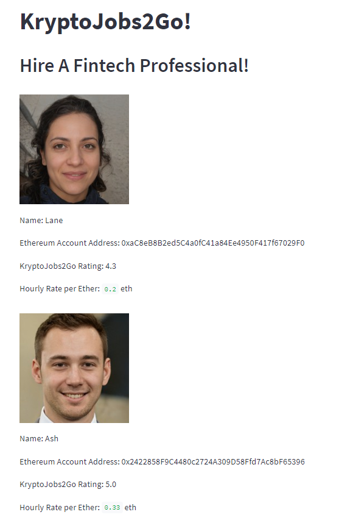
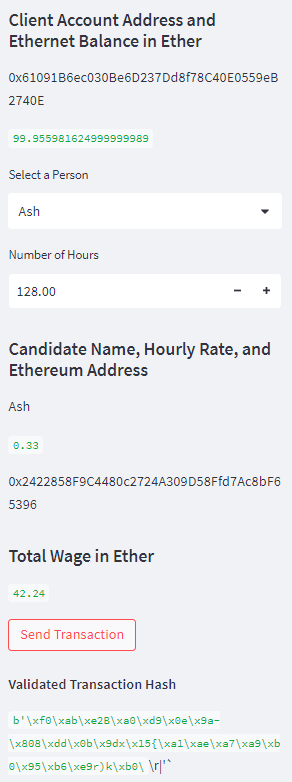
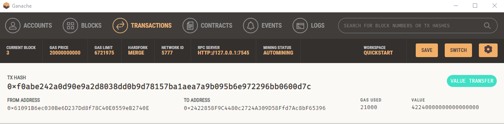

# KryptoJobs2Go

## **Overview of the Cryptocurrecny Wallet**
This blockchain-based wage payment application allows users to find professionals from a list of candidates and pay them in Ether cryptocurrency.
****

## **Folder Structure**

* The `krpyto_job.py` contains the code associated with the web interface *Streamline* application.
* The `crypto_wallet.py` contains the Ethereum transaction functions.
* A `.env` file is required to run the codes. It must include the Mnemonic phrase that appears on Ganache.
* To launch the app enter **streamlit run krypto_job.py** on your python IDE Integrated Development Environment.

`Note`: It is necessary to update the `gas` variable in the `crypto_wallet` to reflect the real-time gas price provided on the Ethereum platform in order to make valid trasactions.

## **Web Interface Navigation**
The developed web interface tool develped using *Streamline* allows the user to view the available candidates, their address rating and wage in Ether/hour on the right-hand side of the webpage. The left-hand side contains input buttons and drop-down menus to select the candidate, input the hours worked and send transactions.
* The  `Select a Person` drop-down menu for selecting one of the candidates exhibited on the right. 
* The `Number of hours` drop-down menu for inputting hours worked by the candidate. Once set click enter to see the amount owed in ether.
* The `Send Trancation` button will digitall sign the transaction and send to the Ganash blockchain, displaying the transaction hash code for reference.

## **Application Outcome**
Here is an example of how the details of the avaiable candidates are presented on the web page.

##### 
Figure 1 - Snapshot of the Wallet Platform

The below snapshot shows the control buttons and menus displaying the amount owed to the selected candidat and allowing for the transaction to be digitaly signed and publushed on the Ganache platform.

##### 
Figure 2 - Transaction Amount & Hash

## **Testing the PyChain Ledger**

The transaction will appear on the Ganache transactions tab showing the amount transferred and the transaction hash as a reference.

##### 
Figure 3 - Ganache Transaction
